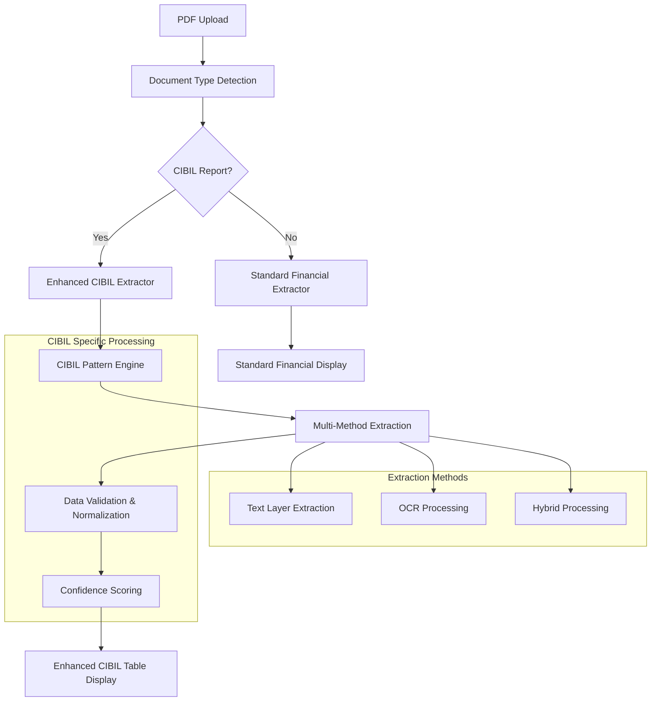
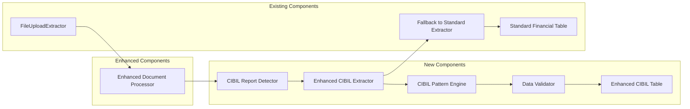

# Enhanced CIBIL Extraction Design Document

## Overview

This design enhances the existing financial data extraction system to provide industry-grade accuracy for CIBIL credit report processing. The solution builds upon the current `FinancialDataExtractor` and `FinancialDataTable` components while introducing CIBIL-specific pattern recognition, improved data validation, and enhanced extraction algorithms.

The design leverages the existing PDF processing infrastructure (OCR, multi-method extraction) and integrates seamlessly with current document processing workflows while providing specialized handling for CIBIL report formats and data patterns.

## Architecture

### High-Level Architecture



### Component Architecture



## Components and Interfaces

### 1. Enhanced CIBIL Data Interface

```typescript
interface EnhancedCibilData extends FinancialData {
  // Core CIBIL Fields (matching your table specification)
  cibilScore: string;
  numberOfLoans: string;
  totalLoanAmount: string;
  amountOverdue: string;
  suitFiledAndDefault: string;
  settledAndWrittenOff: string;
  
  // Enhanced Fields
  reportDate: string;
  applicantName: string;
  panNumber: string;
  accountNumbers: string[];
  
  // New Quality & Analytics Fields
  extractionQuality: ExtractionQuality;
  fieldConfidence: FieldConfidenceMap;
  reportType: 'CIBIL' | 'STANDARD';
  processingMethod: ProcessingMethod[];
}

interface ExtractionQuality {
  overallScore: number; // 0-100
  fieldsExtracted: number;
  totalFields: number;
  qualityLevel: 'HIGH' | 'MEDIUM' | 'LOW';
  validationFlags: ValidationFlag[];
}

interface FieldConfidenceMap {
  cibilScore: number;
  numberOfLoans: number;
  totalLoanAmount: number;
  amountOverdue: number;
  suitFiledAndDefault: number;
  settledAndWrittenOff: number;
}

interface ValidationFlag {
  field: string;
  issue: string;
  severity: 'WARNING' | 'ERROR';
  suggestion?: string;
}
```

### 2. CIBIL Report Detector

```typescript
class CibilReportDetector {
  static detectCibilReport(text: string): boolean;
  static getReportVersion(text: string): string;
  static getReportFormat(text: string): 'STANDARD' | 'DETAILED' | 'SUMMARY';
}
```

### 3. Enhanced CIBIL Extractor

```typescript
class EnhancedCibilExtractor extends FinancialDataExtractor {
  private cibilPatterns: CibilPatternEngine;
  private validator: CibilDataValidator;
  
  constructor(text: string, metadata?: PDFMetadata);
  
  public extractEnhancedCibilData(): EnhancedCibilData;
  private extractWithConfidence(field: string): ExtractionResult;
  private validateExtractedData(data: EnhancedCibilData): ValidationResult;
  private calculateFieldConfidence(field: string, value: string): number;
}
```

### 4. CIBIL Pattern Engine

```typescript
class CibilPatternEngine {
  // CIBIL-specific extraction patterns
  private cibilScorePatterns: RegExp[];
  private loanCountPatterns: RegExp[];
  private amountPatterns: RegExp[];
  private statusPatterns: RegExp[];
  
  public extractCibilScore(text: string): ExtractionResult;
  public extractLoanCount(text: string): ExtractionResult;
  public extractAmounts(text: string, type: AmountType): ExtractionResult;
  public extractLegalStatus(text: string): ExtractionResult;
}
```

### 5. Enhanced CIBIL Table Component

```typescript
interface EnhancedCibilTableProps {
  data: EnhancedCibilData;
  fileName: string;
  showConfidenceScores?: boolean;
  showValidationFlags?: boolean;
  onFieldEdit?: (field: string, value: string) => void;
}

const EnhancedCibilTable: React.FC<EnhancedCibilTableProps>;
```

## Data Models

### CIBIL-Specific Extraction Patterns

#### 1. CIBIL Score Patterns
```typescript
const CIBIL_SCORE_PATTERNS = [
  // Direct score mentions
  /cibil\s*(?:trans\s*union\s*)?score\s*:?\s*(\d{3})/i,
  /credit\s*score\s*:?\s*(\d{3})/i,
  /score\s*:?\s*(\d{3})/i,
  
  // Score in context
  /your\s*(?:cibil\s*)?score\s*(?:is\s*)?:?\s*(\d{3})/i,
  /current\s*score\s*:?\s*(\d{3})/i,
  
  // Score with range validation
  /(\d{3})\s*(?:cibil|credit|score)/i,
  
  // Score in tables/structured format
  /score\s*\|\s*(\d{3})/i,
  /(\d{3})\s*\|\s*score/i
];
```

#### 2. Loan Count Patterns
```typescript
const LOAN_COUNT_PATTERNS = [
  // Direct count mentions
  /(?:total\s*)?(?:number\s*of\s*)?(?:active\s*)?(?:loan|account)s?\s*:?\s*(\d+)/i,
  /(\d+)\s*(?:active\s*)?(?:loan|account)s?\s*(?:found|reported|listed)/i,
  
  // Account summary patterns
  /accounts?\s*in\s*report\s*:?\s*(\d+)/i,
  /total\s*accounts?\s*:?\s*(\d+)/i,
  
  // Credit facility patterns
  /(?:credit\s*)?facilit(?:y|ies)\s*:?\s*(\d+)/i,
  /(\d+)\s*credit\s*lines?/i
];
```

#### 3. Amount Extraction Patterns
```typescript
const AMOUNT_PATTERNS = {
  TOTAL_LOAN: [
    /total\s*(?:loan\s*)?(?:sanctioned\s*)?amount\s*:?\s*(?:rs\.?\s*|₹\s*)?([₹\d,]+(?:\.\d{2})?)/i,
    /sanctioned\s*amount\s*:?\s*(?:rs\.?\s*|₹\s*)?([₹\d,]+(?:\.\d{2})?)/i,
    /principal\s*(?:amount\s*)?:?\s*(?:rs\.?\s*|₹\s*)?([₹\d,]+(?:\.\d{2})?)/i,
    /credit\s*limit\s*:?\s*(?:rs\.?\s*|₹\s*)?([₹\d,]+(?:\.\d{2})?)/i
  ],
  
  OVERDUE: [
    /(?:amount\s*)?overdue\s*:?\s*(?:rs\.?\s*|₹\s*)?([₹\d,]+(?:\.\d{2})?)/i,
    /outstanding\s*(?:amount\s*)?:?\s*(?:rs\.?\s*|₹\s*)?([₹\d,]+(?:\.\d{2})?)/i,
    /current\s*balance\s*:?\s*(?:rs\.?\s*|₹\s*)?([₹\d,]+(?:\.\d{2})?)/i,
    /dues\s*:?\s*(?:rs\.?\s*|₹\s*)?([₹\d,]+(?:\.\d{2})?)/i
  ],
  
  SETTLED: [
    /settled\s*(?:amount\s*)?:?\s*(?:rs\.?\s*|₹\s*)?([₹\d,]+(?:\.\d{2})?)/i,
    /written\s*off\s*(?:amount\s*)?:?\s*(?:rs\.?\s*|₹\s*)?([₹\d,]+(?:\.\d{2})?)/i,
    /closure\s*amount\s*:?\s*(?:rs\.?\s*|₹\s*)?([₹\d,]+(?:\.\d{2})?)/i
  ]
};
```

### Data Validation Rules

```typescript
const VALIDATION_RULES = {
  CIBIL_SCORE: {
    min: 300,
    max: 900,
    required: true,
    pattern: /^\d{3}$/
  },
  
  LOAN_COUNT: {
    min: 0,
    max: 50,
    required: false,
    pattern: /^\d+$/
  },
  
  AMOUNTS: {
    min: 0,
    max: 100000000000, // 100 Cr
    required: false,
    format: 'currency'
  },
  
  PAN_NUMBER: {
    pattern: /^[A-Z]{5}\d{4}[A-Z]$/,
    required: false,
    length: 10
  }
};
```

## Error Handling

### 1. Extraction Error Handling

```typescript
class ExtractionError extends Error {
  constructor(
    public field: string,
    public reason: string,
    public severity: 'WARNING' | 'ERROR'
  ) {
    super(`Extraction failed for ${field}: ${reason}`);
  }
}

class CibilExtractionHandler {
  static handleExtractionError(error: ExtractionError): ExtractionResult {
    // Log error for monitoring
    console.warn(`CIBIL Extraction Warning: ${error.message}`);
    
    // Return fallback result
    return {
      value: '',
      confidence: 0,
      method: 'FAILED',
      error: error.reason
    };
  }
  
  static validateAndCorrect(field: string, value: string): ValidationResult {
    // Apply field-specific validation and correction
    switch (field) {
      case 'cibilScore':
        return this.validateCibilScore(value);
      case 'amounts':
        return this.validateAmount(value);
      default:
        return { isValid: true, correctedValue: value };
    }
  }
}
```

### 2. Fallback Mechanisms

```typescript
class CibilExtractionFallback {
  static fallbackToStandardExtraction(text: string): FinancialData {
    // Fall back to existing FinancialDataExtractor
    const standardExtractor = new FinancialDataExtractor(text);
    return standardExtractor.extractAll();
  }
  
  static combineExtractionResults(
    cibilResult: Partial<EnhancedCibilData>,
    standardResult: FinancialData
  ): EnhancedCibilData {
    // Merge results, prioritizing CIBIL-specific extraction
    return {
      ...standardResult,
      ...cibilResult,
      reportType: 'CIBIL',
      extractionQuality: this.calculateCombinedQuality(cibilResult, standardResult)
    };
  }
}
```

## Testing Strategy

### 1. Unit Testing

```typescript
describe('EnhancedCibilExtractor', () => {
  describe('CIBIL Score Extraction', () => {
    test('should extract valid CIBIL scores', () => {
      const extractor = new EnhancedCibilExtractor('Your CIBIL Score: 750');
      const result = extractor.extractCibilScore();
      expect(result.value).toBe('750');
      expect(result.confidence).toBeGreaterThan(0.9);
    });
    
    test('should reject invalid scores', () => {
      const extractor = new EnhancedCibilExtractor('Score: 999');
      const result = extractor.extractCibilScore();
      expect(result.value).toBe('');
      expect(result.confidence).toBe(0);
    });
  });
  
  describe('Amount Extraction', () => {
    test('should handle various currency formats', () => {
      const testCases = [
        { input: 'Total Loan: ₹5,00,000', expected: '₹5.00 L' },
        { input: 'Amount: Rs. 2 Cr', expected: '₹2.00 Cr' },
        { input: 'Outstanding: 50000', expected: '₹50.00 K' }
      ];
      
      testCases.forEach(({ input, expected }) => {
        const extractor = new EnhancedCibilExtractor(input);
        const result = extractor.extractTotalLoanAmount();
        expect(result.value).toBe(expected);
      });
    });
  });
});
```

### 2. Integration Testing

```typescript
describe('CIBIL Report Processing Integration', () => {
  test('should process complete CIBIL report', async () => {
    const mockCibilPdf = await loadTestPdf('sample_cibil_report.pdf');
    const processor = new DocumentProcessor();
    
    const result = await processor.processDocument(mockCibilPdf);
    
    expect(result.reportType).toBe('CIBIL');
    expect(result.extractionQuality.overallScore).toBeGreaterThan(80);
    expect(result.cibilScore).toMatch(/^\d{3}$/);
  });
  
  test('should fallback gracefully for non-CIBIL reports', async () => {
    const mockStandardPdf = await loadTestPdf('standard_financial_report.pdf');
    const processor = new DocumentProcessor();
    
    const result = await processor.processDocument(mockStandardPdf);
    
    expect(result.reportType).toBe('STANDARD');
    expect(result).toHaveProperty('cibilScore');
  });
});
```

### 3. End-to-End Testing

```typescript
describe('CIBIL Extraction E2E', () => {
  test('should complete full extraction workflow', async () => {
    // Upload CIBIL report
    const uploadComponent = render(<FileUploadExtractor />);
    const fileInput = uploadComponent.getByTestId('file-input');
    
    const cibilFile = new File([mockCibilPdfBuffer], 'cibil_report.pdf', {
      type: 'application/pdf'
    });
    
    fireEvent.change(fileInput, { target: { files: [cibilFile] } });
    
    // Wait for processing
    await waitFor(() => {
      expect(uploadComponent.getByTestId('cibil-table')).toBeInTheDocument();
    });
    
    // Verify extracted data
    expect(uploadComponent.getByText(/CIBIL Score/)).toBeInTheDocument();
    expect(uploadComponent.getByText(/Number of loans/)).toBeInTheDocument();
    expect(uploadComponent.getByTestId('extraction-quality')).toBeInTheDocument();
  });
});
```

### 4. Performance Testing

```typescript
describe('CIBIL Extraction Performance', () => {
  test('should process large CIBIL reports within time limits', async () => {
    const largeCibilReport = generateLargeCibilReport(100); // 100 pages
    const startTime = Date.now();
    
    const extractor = new EnhancedCibilExtractor(largeCibilReport);
    const result = await extractor.extractEnhancedCibilData();
    
    const processingTime = Date.now() - startTime;
    expect(processingTime).toBeLessThan(30000); // 30 seconds max
    expect(result.extractionQuality.overallScore).toBeGreaterThan(70);
  });
});
```

## Implementation Approach

### Phase 1: Core CIBIL Detection and Extraction
1. Implement `CibilReportDetector` for automatic CIBIL report identification
2. Create `EnhancedCibilExtractor` with CIBIL-specific patterns
3. Develop `CibilPatternEngine` with comprehensive extraction patterns
4. Add validation and confidence scoring

### Phase 2: Enhanced UI Components
1. Extend `FinancialDataTable` to `EnhancedCibilTable`
2. Add confidence score displays and validation flags
3. Implement field-level quality indicators
4. Add export enhancements for CIBIL-specific data

### Phase 3: Integration and Optimization
1. Integrate with existing `FileUploadExtractor` and `DocumentProcessor`
2. Add fallback mechanisms to standard extraction
3. Implement comprehensive error handling
4. Optimize performance for large reports

### Phase 4: Quality Assurance and Monitoring
1. Add extraction analytics and monitoring
2. Implement A/B testing for pattern improvements
3. Add user feedback mechanisms for extraction accuracy
4. Create admin dashboard for extraction quality monitoring

This design provides a comprehensive enhancement to your existing CIBIL processing capabilities while maintaining backward compatibility and leveraging your current infrastructure.