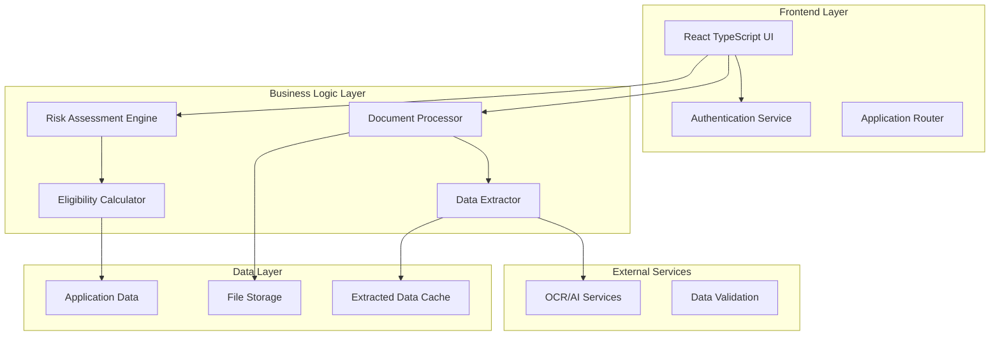

# Design Document: MSME Loan System Revival

## Overview

The MSME Loan Qualification System Revival transforms an existing loan processing application into a streamlined, intelligent document processing platform focused exclusively on Loan Officers. The system leverages AI-powered document extraction, automated risk assessment, and MSME-specific financial analysis to accelerate loan processing while maintaining rigorous risk management standards.

The design emphasizes a clean, single-role architecture that eliminates complexity while adding sophisticated document intelligence capabilities. The system processes multiple financial document types, extracts structured data, and provides comprehensive risk assessment tools tailored for MSME lending requirements.

## Architecture

### High-Level Architecture



### Component Architecture

The system follows a modular component architecture with clear separation of concerns:

- **Authentication Layer**: Simplified single-role authentication for Loan Officers
- **Document Processing Layer**: Handles file uploads, validation, and routing to extraction services
- **Data Extraction Layer**: AI-powered extraction of structured data from financial documents
- **Risk Assessment Layer**: Automated calculation of risk scores and eligibility metrics
- **Presentation Layer**: React components for data visualization and user interaction

## Components and Interfaces

### Core Components

#### AuthContext (Modified)
```typescript
interface AuthContextType {
  user: LoanOfficer | null;
  login: (credentials: LoginCredentials) => Promise<void>;
  logout: () => void;
  isAuthenticated: boolean;
}

interface LoanOfficer {
  id: string;
  name: string;
  email: string;
  role: 'loan_officer';
  permissions: string[];
}
```

#### DocumentUploadPanel
```typescript
interface DocumentUploadPanelProps {
  onUploadComplete: (documents: UploadedDocument[]) => void;
  supportedTypes: DocumentType[];
  maxFileSize: number;
}

interface UploadedDocument {
  id: string;
  filename: string;
  type: DocumentType;
  size: number;
  uploadedAt: Date;
  extractionStatus: 'pending' | 'processing' | 'completed' | 'failed';
}

type DocumentType = 
  | 'balance_sheet' 
  | 'profit_loss' 
  | 'bank_statement' 
  | 'gst_return' 
  | 'itr_document' 
  | 'cibil_report';
```

#### FinancialDataExtractor (Enhanced)
```typescript
interface FinancialDataExtractor {
  extractFromDocument(document: UploadedDocument): Promise<ExtractedData>;
  validateExtraction(data: ExtractedData): ValidationResult;
  getExtractionPatterns(documentType: DocumentType): ExtractionPattern[];
}

interface ExtractedData {
  documentId: string;
  documentType: DocumentType;
  extractedFields: Record<string, any>;
  confidence: number;
  extractedAt: Date;
  validationErrors: string[];
}

interface BalanceSheetData {
  totalAssets: number;
  totalLiabilities: number;
  currentAssets: number;
  fixedAssets: number;
  currentLiabilities: number;
  longTermDebt: number;
  netWorth: number;
  workingCapital: number;
}

interface ProfitLossData {
  revenue: number;
  costOfGoods: number;
  grossProfit: number;
  operatingExpenses: number;
  ebitda: number;
  netProfit: number;
  profitMargins: {
    gross: number;
    operating: number;
    net: number;
  };
}

interface BankStatementData {
  averageMonthlyBalance: number;
  cashFlowPattern: 'positive' | 'negative' | 'volatile';
  loanEmis: number;
  chequeBounces: number;
  creditsDebitsRatio: number;
  monthlyTransactionVolume: number;
}

interface GSTReturnData {
  monthlyTurnover: number;
  gstPaid: number;
  inputCredit: number;
  filingRegularity: number; // percentage
  complianceScore: number;
}

interface CIBILReportData {
  creditScore: number;
  activeLoans: number;
  paymentHistory: 'excellent' | 'good' | 'fair' | 'poor';
  defaults: number;
  settledAccounts: number;
  creditUtilization: number;
}
```

#### FinancialSummaryCard
```typescript
interface FinancialSummaryCardProps {
  extractedData: ExtractedData[];
  showVisualIndicators: boolean;
  onDataUpdate: (updatedData: ExtractedData) => void;
}

interface FinancialIndicator {
  label: string;
  value: number | string;
  status: 'good' | 'warning' | 'critical';
  threshold: {
    good: number;
    warning: number;
  };
}
```

#### MSMEEligibilityCalculator
```typescript
interface MSMEEligibilityCalculator {
  calculateEligibility(applicationData: ApplicationData): EligibilityResult;
  calculateDSCR(financialData: FinancialData): number;
  calculateCurrentRatio(balanceSheet: BalanceSheetData): number;
  analyzeRevenueGrowth(historicalData: FinancialData[]): GrowthAnalysis;
  scoreGSTCompliance(gstData: GSTReturnData): number;
  scoreBankingRelationship(bankData: BankStatementData): number;
  applyIndustryRiskFactors(industry: string, baseScore: number): number;
}

interface EligibilityResult {
  overallScore: number;
  eligibilityStatus: 'eligible' | 'conditional' | 'not_eligible';
  breakdown: {
    dscr: number;
    currentRatio: number;
    revenueGrowth: number;
    gstCompliance: number;
    bankingRelationship: number;
    industryRisk: number;
  };
  recommendations: string[];
  requiredDocuments: string[];
}

interface FinancialData {
  balanceSheet: BalanceSheetData;
  profitLoss: ProfitLossData;
  bankStatement: BankStatementData;
  gstReturn: GSTReturnData;
  cibilReport: CIBILReportData;
}
```

#### RiskAssessmentEngine
```typescript
interface RiskAssessmentEngine {
  calculateRiskScore(applicationData: ApplicationData): RiskAssessment;
  detectInconsistencies(extractedData: ExtractedData[]): Inconsistency[];
  compareWithBenchmarks(financialData: FinancialData, industry: string): BenchmarkComparison;
  generateRiskAlerts(riskScore: number, inconsistencies: Inconsistency[]): RiskAlert[];
}

interface RiskAssessment {
  overallRiskScore: number;
  riskCategory: 'low' | 'medium' | 'high' | 'very_high';
  riskFactors: RiskFactor[];
  mitigationSuggestions: string[];
  approvalRecommendation: 'approve' | 'conditional' | 'reject';
}

interface RiskFactor {
  category: string;
  description: string;
  impact: 'low' | 'medium' | 'high';
  weight: number;
  value: number;
}

interface Inconsistency {
  type: 'data_mismatch' | 'calculation_error' | 'missing_data';
  description: string;
  severity: 'low' | 'medium' | 'high';
  affectedDocuments: string[];
  suggestedAction: string;
}
```

## Data Models

### Application Data Model
```typescript
interface ApplicationData {
  id: string;
  applicantInfo: {
    businessName: string;
    businessType: string;
    industry: string;
    registrationNumber: string;
    gstNumber: string;
    panNumber: string;
    address: BusinessAddress;
    contactInfo: ContactInfo;
  };
  loanDetails: {
    requestedAmount: number;
    purpose: string;
    tenure: number;
    collateral?: CollateralInfo;
  };
  financialData: FinancialData;
  documents: UploadedDocument[];
  eligibilityResult?: EligibilityResult;
  riskAssessment?: RiskAssessment;
  status: ApplicationStatus;
  createdAt: Date;
  updatedAt: Date;
  processedBy: string; // Loan Officer ID
}

type ApplicationStatus = 
  | 'draft' 
  | 'document_upload' 
  | 'data_extraction' 
  | 'under_review' 
  | 'approved' 
  | 'rejected' 
  | 'conditional_approval';
```

### Document Processing Pipeline
```typescript
interface DocumentProcessingPipeline {
  stages: ProcessingStage[];
  currentStage: number;
  status: 'pending' | 'processing' | 'completed' | 'failed';
  errors: ProcessingError[];
}

interface ProcessingStage {
  name: string;
  description: string;
  processor: string;
  status: 'pending' | 'processing' | 'completed' | 'failed';
  startTime?: Date;
  endTime?: Date;
  output?: any;
}
```

## Correctness Properties

*A property is a characteristic or behavior that should hold true across all valid executions of a system—essentially, a formal statement about what the system should do. Properties serve as the bridge between human-readable specifications and machine-verifiable correctness guarantees.*

Based on the prework analysis, the following properties have been identified to validate the system's correctness:

### Property 1: Authentication Role Validation
*For any* authentication attempt, only valid Loan Officer credentials should be accepted, and all other credential types should be rejected
**Validates: Requirements 1.2**

### Property 2: Document Format Support
*For any* supported document type (Balance Sheet, P&L Statement, Bank Statement, GST Return, ITR Document, CIBIL Report), the system should accept uploads in their specified formats (PDF/Excel as appropriate) and reject unsupported formats
**Validates: Requirements 2.2, 2.3, 2.4, 2.5, 2.6, 2.7**

### Property 3: File Upload Validation
*For any* document upload attempt, the system should validate file format and size constraints, accepting valid files and rejecting invalid ones with descriptive error messages
**Validates: Requirements 2.8, 2.9**

### Property 4: Document-Specific Data Extraction
*For any* uploaded financial document of a specific type, the Document Intelligence Engine should extract all required fields for that document type (e.g., Total Assets from Balance Sheets, Revenue from P&L Statements)
**Validates: Requirements 3.1, 3.2, 3.3, 3.4, 3.5**

### Property 5: Extraction Error Handling
*For any* data extraction failure, the system should log the error and notify the Loan Officer with appropriate error information
**Validates: Requirements 3.6**

### Property 6: Extracted Data Validation
*For any* extracted financial data, the system should validate completeness and flag missing critical fields
**Validates: Requirements 3.7**

### Property 7: Financial Data Display
*For any* extracted financial data, the system should display it in the FinancialSummaryCard component with appropriate visual indicators based on value thresholds
**Validates: Requirements 4.1, 4.2**

### Property 8: Threshold-Based Warning Indicators
*For any* financial ratio that exceeds safe thresholds, the system should highlight it with warning indicators
**Validates: Requirements 4.4**

### Property 9: Data Organization by Document Type
*For any* set of extracted data from multiple documents, the system should organize and categorize the data by document type
**Validates: Requirements 4.5**

### Property 10: Document Import and Pre-population
*For any* document import operation, the system should pre-populate application fields with extracted data and validate for inconsistencies
**Validates: Requirements 5.2, 5.3, 5.4**

### Property 11: Document Preview Capability
*For any* uploaded document, the system should provide inline preview capability
**Validates: Requirements 6.3**

### Property 12: Eligibility Score Display
*For any* calculated eligibility score, the system should display a detailed breakdown of contributing factors
**Validates: Requirements 6.4, 7.7**

### Property 13: Risk Factor Highlighting
*For any* identified risk factors, the system should highlight them prominently with appropriate warning indicators
**Validates: Requirements 6.5**

### Property 14: DSCR Calculation Accuracy
*For any* financial data containing net operating income and debt service information, the Eligibility Calculator should calculate DSCR as NOI divided by total debt service
**Validates: Requirements 7.1**

### Property 15: Current Ratio Calculation Accuracy
*For any* balance sheet data, the Eligibility Calculator should calculate current ratio as current assets divided by current liabilities
**Validates: Requirements 7.2**

### Property 16: Revenue Growth Analysis
*For any* historical financial data, the Eligibility Calculator should analyze revenue growth trends and provide growth metrics
**Validates: Requirements 7.3**

### Property 17: GST Compliance Scoring
*For any* GST return data, the Eligibility Calculator should score compliance based on filing regularity and payment history
**Validates: Requirements 7.4**

### Property 18: Banking Relationship Scoring
*For any* bank statement data, the Eligibility Calculator should score banking relationship based on account history and transaction patterns
**Validates: Requirements 7.5**

### Property 19: Industry Risk Factor Application
*For any* eligibility calculation, the system should apply industry-specific risk factors based on the applicant's business sector
**Validates: Requirements 7.6**

### Property 20: Risk Score Calculation
*For any* extracted financial data, the Risk Assessment Engine should calculate overall risk scores using standardized risk assessment algorithms
**Validates: Requirements 8.1**

### Property 21: Document Inconsistency Detection
*For any* set of financial documents from the same applicant, the Risk Assessment Engine should flag inconsistencies between different document data
**Validates: Requirements 8.2**

### Property 22: Industry Benchmark Comparison
*For any* applicant financial metrics, the Risk Assessment Engine should compare them against industry benchmarks and provide comparison results
**Validates: Requirements 8.3**

### Property 23: Risk Threshold Alert Generation
*For any* risk score that exceeds acceptable thresholds, the system should generate appropriate alerts
**Validates: Requirements 8.4**

### Property 24: Risk Score Explanation Generation
*For any* calculated risk score, the system should provide detailed explanations of the calculation methodology and contributing factors
**Validates: Requirements 8.5**

### Property 25: Real-time Risk Alert Display
*For any* high-risk application, the system should display real-time alerts on the risk management dashboard
**Validates: Requirements 9.1**

### Property 26: Portfolio Trend Analysis
*For any* portfolio of applications, the system should provide trend analysis for health metrics over time
**Validates: Requirements 9.2**

### Property 27: Sector Concentration Warnings
*For any* portfolio approaching sector exposure limits, the system should show concentration warnings
**Validates: Requirements 9.3**

### Property 28: Alert Filtering and Sorting
*For any* set of risk alerts, the system should allow filtering and sorting by severity and type
**Validates: Requirements 9.4**

### Property 29: Risk Report Export
*For any* risk data, the system should provide exportable reports suitable for management review
**Validates: Requirements 9.5**

### Property 30: Navigation Route Functionality
*For any* application route, navigation should work correctly and display the appropriate page content
**Validates: Requirements 10.3**

## Error Handling

### Document Processing Errors
- **File Format Validation**: Reject unsupported file formats with clear error messages
- **File Size Limits**: Enforce maximum file size constraints (e.g., 50MB per document)
- **Extraction Failures**: Graceful handling of OCR/AI extraction failures with fallback options
- **Data Validation Errors**: Clear indication of missing or invalid extracted data

### Authentication and Authorization Errors
- **Invalid Credentials**: Clear error messages for failed login attempts
- **Session Expiration**: Automatic redirect to login with session timeout notification
- **Permission Denied**: Appropriate error handling for unauthorized access attempts

### Calculation and Processing Errors
- **Missing Data**: Handle incomplete financial data with appropriate warnings
- **Calculation Errors**: Validate input data before performing financial calculations
- **API Failures**: Graceful degradation when external services are unavailable
- **Concurrent Access**: Handle multiple users accessing the same application data

### User Interface Error Handling
- **Network Connectivity**: Offline mode indicators and retry mechanisms
- **Loading States**: Clear progress indicators for long-running operations
- **Form Validation**: Real-time validation with helpful error messages
- **Data Persistence**: Auto-save functionality to prevent data loss

## Testing Strategy

### Dual Testing Approach

The system will employ both unit testing and property-based testing to ensure comprehensive coverage:

**Unit Tests**: Focus on specific examples, edge cases, and error conditions
- Test specific document upload scenarios
- Validate individual calculation functions with known inputs/outputs
- Test UI component rendering with specific data sets
- Verify error handling for specific failure cases

**Property-Based Tests**: Verify universal properties across all inputs
- Test document processing with randomly generated valid documents
- Verify calculation accuracy across wide ranges of financial data
- Test data extraction consistency across various document formats
- Validate risk assessment algorithms with diverse input combinations

### Property-Based Testing Configuration

**Testing Framework**: Use `fast-check` for TypeScript property-based testing
- Minimum 100 iterations per property test to ensure thorough coverage
- Each property test must reference its corresponding design document property
- Tag format: **Feature: msme-loan-system-revival, Property {number}: {property_text}**

**Test Data Generation**:
- **Financial Data Generators**: Create realistic financial data within valid ranges
- **Document Generators**: Generate various document formats and structures
- **Edge Case Generators**: Include boundary values and extreme scenarios
- **Invalid Data Generators**: Test error handling with malformed inputs

### Integration Testing

**End-to-End Workflows**:
- Complete loan application processing from document upload to risk assessment
- Multi-document upload and cross-validation scenarios
- User authentication and session management flows
- Dashboard functionality and real-time updates

**API Integration Testing**:
- Document extraction service integration
- External validation service connectivity
- Database operations and data persistence
- File storage and retrieval operations

### Performance Testing

**Load Testing**:
- Document processing under high volume
- Concurrent user access scenarios
- Large file upload handling
- Database query performance optimization

**Stress Testing**:
- System behavior under resource constraints
- Memory usage during document processing
- Response time degradation analysis
- Recovery from system failures

### Security Testing

**Authentication Security**:
- Credential validation and encryption
- Session management and timeout handling
- Authorization boundary testing
- SQL injection and XSS prevention

**Data Security**:
- File upload security validation
- Sensitive data encryption at rest and in transit
- Access control verification
- Audit trail completeness

This comprehensive testing strategy ensures that the MSME Loan System Revival meets all functional requirements while maintaining high reliability, security, and performance standards.